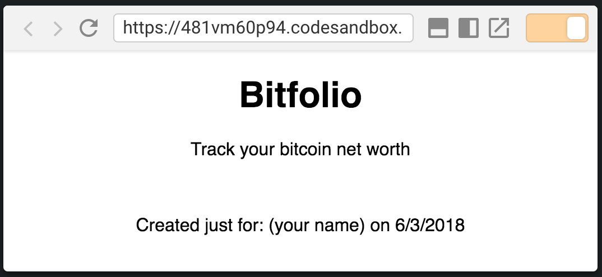
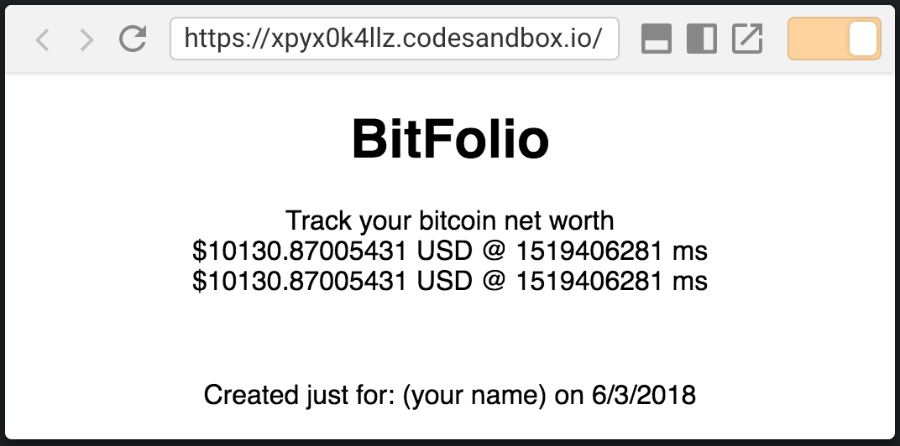
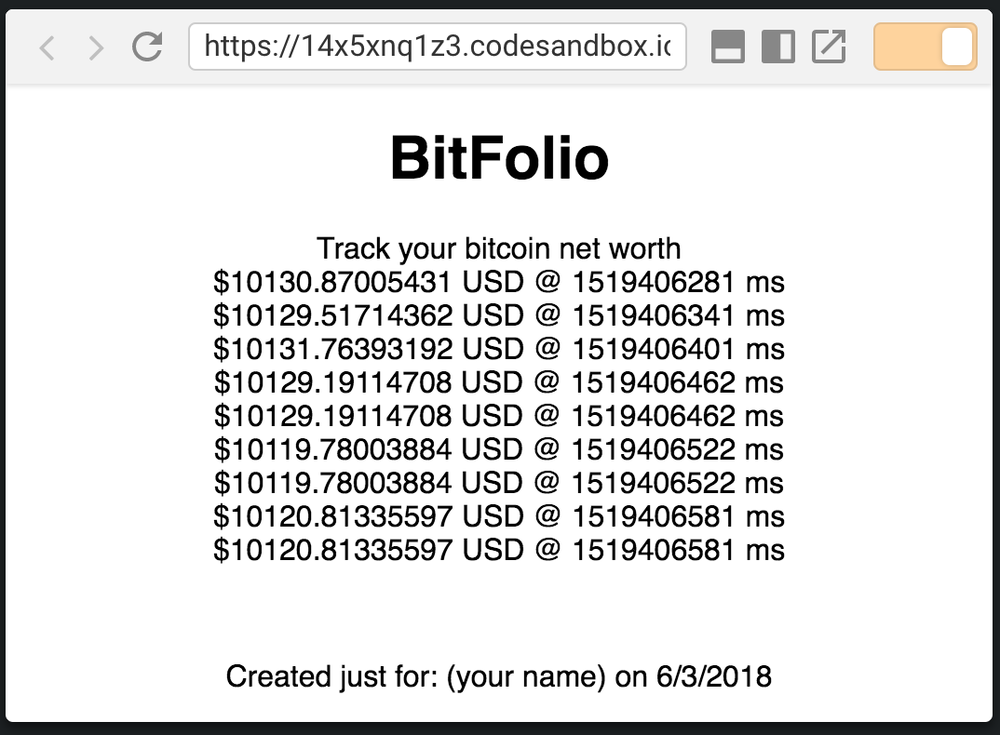
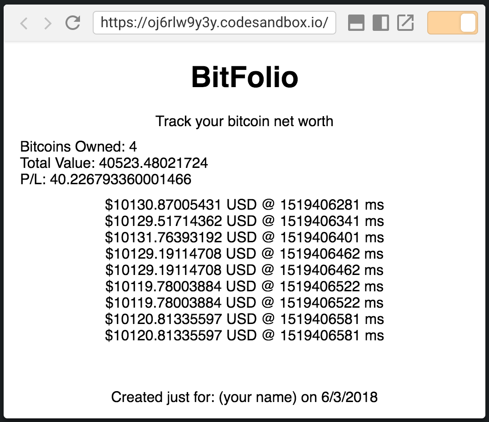
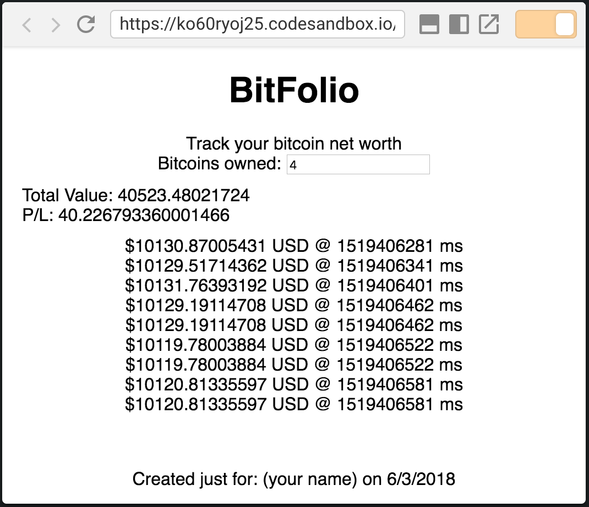
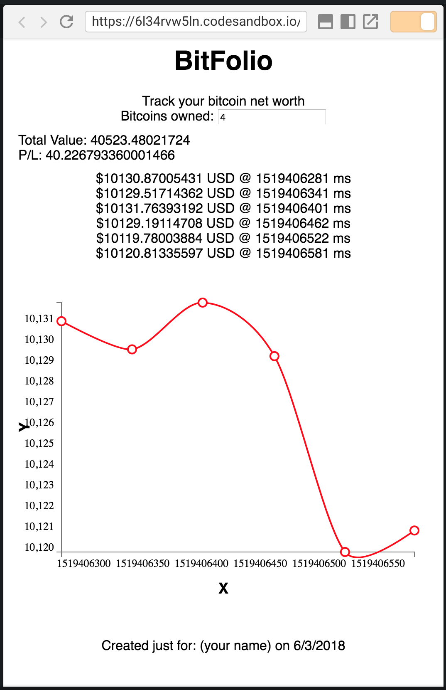
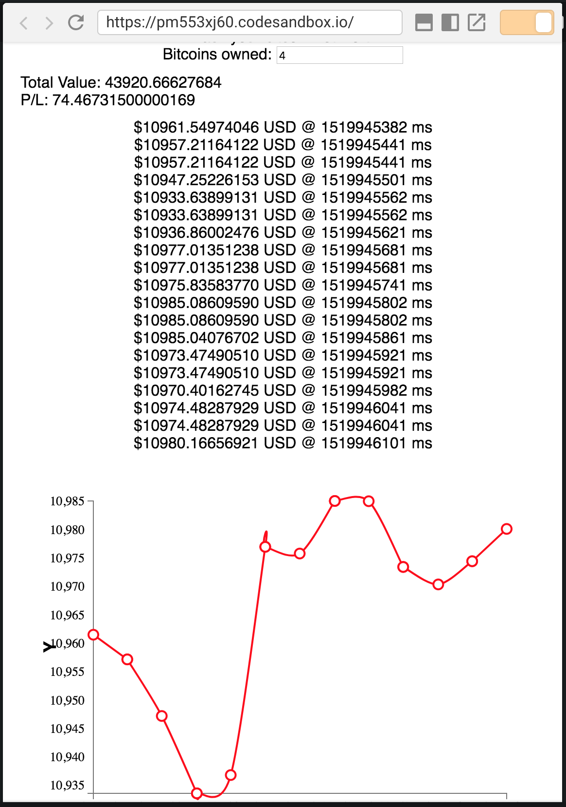

# React 101 Workshop #
* * *
### Goals ###
In this hands-on workshop, you will learn how to:
- Create and render multiple React components
- Work with component data, including props and state
- Reuse an open source component
- Integrate REST services into your React application

### Resources ###

We will be using the following resources

#### codesandbox.io

We will use [https://codesandbox.io](https://codesandbox.io) to code this workshop without the need of any software or library installations.

#### Slide Deck

You can also follow along the exercises with with these [workshop slides](https://docs.google.com/presentation/d/1doCHvgu_0ZGm9RR3CcGxdKB4nxXEeSAzkOEyqDBGb4Y/edit?usp=sharing)

---
## Exercises ##
- [Exercise 1: Create your first React component](#Exercise1)
- [Exercise 2: Pass custom data to a component using props](#Exercise2)
- [Exercise 3: Render multiple components](#Exercise3)
- [Exercise 4: Use State to manage how your component renders & behaves](#Exercise4)
- [Exercise 5: Use controlled components in React](#Exercise5)
- [Exercise 6: Use Open Source Components](#Exercise6)
- [Exercise 7: Use of Lifecycle Methods](#Exercise7)
- [Exercise 8: Connect to a REST service](#Exercise8)

At the beginning of each exercise, there is a "Starting Point" codesandbox project. At the end of each exercise there is a "Solution" codesandbox project. Use these to quickly get caught up with the workshop if there are any issues during an exercise. For example, if you encounter an issue with your code during exercise 3 and the workshop moves on to exercise 4. You will be able to use exercise 4 "Starting Point" project to continue on with the workshop and overcome the issues with your previous code. The "Solution" to Exercise 3 is identical to the "Starting Point" of Exercise 4.

<a name="Exercise1"></a>
## Exercise 1: Create your first React component ##
Start with the [Starting Point](https://codesandbox.io/s/0y2vm4mmvw) from this exercise. Codesandbox simplifies and hides the build configuration so that only React code is the main focus. This makes it possible to begin coding right away!

**Starting point:** https://codesandbox.io/s/0y2vm4mmvw

1. Open the "Starting Point" project and there is html code for a simple web page. In the the `index.js` file, change the title to `"Hello San Diego JS"` by editing the text on the `<h1>` tag. You will see that a save button appears on the top menu bar, click it to save the project to your own profile. 

   ​
    
   ​

2. Convert the title `<h1>` tag into its own react component. On the left hand panel, click on the "src" folder and then click on the "New File" icon that appers on the menu right hand side to create the `header.js` file.

    

    Add the following code in `header.js` and then save the file:
    ```javascript
    // src/header.js
    import React from "react";

    class Title extends React.Component {
      render() {
        return <h1>Bitfolio</h1>;
      }
    }
    class SubTitle extends React.Component {
      render() {
        return <div>Track your bitcoin net worth</div>;
      }
    }
    export class Header extends React.Component {
      render() {
        return (
          <div>
            <Title />
            <SubTitle />
          </div>
        );
      }
    }
    ```
    There are actually three components being created in this file. Each class that extends `React.Component` is a component. The `Title` and `SubTitle` components are used the render method of the `Header` component. The way that the components are written like html tags is what JSX is all about. This workshop isn't going to cover the details of JSX, but just know that it allows you to reuse your components as though they were html elements themselves. Finally, the `Header` component is exported so that it can be used in other files.

3. In `index.js`, import the `Header` component from `src/header.js`. Add the following to the top of the file with the rest of the imports.
    ```javascript
    // src/index.js
    import { Header } from "./header";
    ```
    Replace the `<h1>` title tag with the `Header` component.
     ```javascript
    // src/index.js
    <div style={styles}>
        <Header />
        <h2>Start editing to see some magic happen {"\u2728"}</h2>
      </div>
     ```
    The `Header` component now displays on the web page. Any changes made to the `Header` component will update and be rendered in the browser window.

4. Now do the same with the footer. Create a new file called `footer.js` under the `src` directory. Add the following code to `footer.js` and then save the file:
    ```javascript
    // src/footer.js
    import React from "react";
    const styles = {
      margin: "50px"
    };
    export class Footer extends React.Component {
      render() {
        return (
          <footer style={styles}>Created just for: (your name) on 6/3/2018</footer>
        );
      }
    }
    ```
    Import the `Footer` component in `index.js`. Add the following code:
    ```javascript
    // src/index.js
    import { Footer } from "./footer";
    ```
    Replace the `<h2>`  tag with the `Footer` component:
     ```javascript
    // src/index.js
    <div style={styles}>
        <Header />
        <Footer />
      </div>
     ```
    The `Header` and `Footer` of the app are now extracted from the main page. If there were more pages, importing and reusing those same components would render the same header and footer on each page.

**Solution:** https://codesandbox.io/s/k0x77oymvr


<a name="Exercise2"></a> 
## Exercise 2: Pass custom data to a component using props ##
**Starting point:** https://codesandbox.io/s/481vm60p94

Components can dynamically render different data that is passed into them. Data passed into a component is called a `prop`. Using props allows Components to act like a template that defines a structure of html and other Components with placeholders for data that will be passed in. 

1. Create a new folder `portfolio` under the `src` folder by clicking on the `New Folder` icon right next to the `New File` button. Inside the `portfolio` folder, create a file called `index.js`. Add the following code:
    ```javascript
    // src/portfolio/index.js
    import React from "react";
    import { data } from "../data";
    export class Portfolio extends React.Component {
      render() {
        const price0 = data[0].ticker.price;
        const time0 = data[0].timestamp;
        const price1 = data[1].ticker.price;
        const time1 = data[1].timestamp;
        return (
          <div>
            ${price0} USD @ {time0} ms <br />
            ${price1} USD @ {time1} ms
          </div>
        );
      }
    }
    ```
    This creates a new component called `Portfolio`. `data` is imported from the existing `data.js` file which is prepulated with price point data of Bitcoin.

    Right now, the render method just returns a `div` with a line of text, followed by a break, followed by another line of text. Each line of text shows the price at a certain time. It is easy to already see that rendering prices and times this way will follow a pattern. Since it follows a pattern, it is a great candidate for code reuse as a Component.

2. Import the `Portfolio` component in `src/index.js`. Add the following code to the top of the file with the rest of the imports:

    ```javascript
    // src/index.js
    import { Portfolio } from "./portfolio";
    ```
    Add the `Portfolio` component between the `Header` and `Footer` in the render method of `App`:
    ```javascript
    // src/index.js
    <div style={styles}>
        <Header />
        <Portfolio />
        <Footer />
     </div>
    ```

3. Create a `Price` component that renders just one line of the price points that is being rendered in `Portfolio`. Create a new file named `price.js` inside the `portfolio` folder and add the following code:
    ```javascript
    // src/portfolio/price.js
    import React from "react";
    export class Price extends React.Component {
      render() {
        return (
          <div>
            ${this.props.price} USD @ {this.props.time} ms
          </div>
        );
      }
    }
    ```
    Inside of the `div` there is code that looks like `{this.props.price}`. The curly braces allow you to inject the value of a variable into what is rendered on the screen. `this.props.price` is a variable that the `Price` component is expecting will be passed into it when another render method calls it. The same goes for the variable `this.props.time`. This creates a simple template of a `div` that renders some text where the variables for `price` and `time` can be passed in as data from a parent component.

4. Import the `Price` component in the `Portfolio`. Add the following code to the top of the file with the rest of the imports:

    ```javascript
    // src/portfolio/index.js
    import { Price } from "./price";
    ```
    Use the `Price` component to replace the hard-coded lines of text in the render method of the `Portfolio` component:
    ```javascript
    // src/portfolio/index.js
    <div>
        <Price price={price0} time={time0} />
        <Price price={price1} time={time1} />
    </div>
    ```

    Differnt price and time variables are passed into each `Price` component. Each individual component will render these values into the template defined by the `Price` component's render method.

**Solution:** https://codesandbox.io/s/9zq8xk97qo


<a name="Exercise3"></a>
## Exercise 3: Render multiple components ##
**Starting point:** https://codesandbox.io/s/xpyx0k4llz

It doesn't really make sense to type out the `Price` component for each instance of it if there are going to be a lot of data points. This exercise will show how to use an array of data to programmatically generate components and pass different props into each one.

1. In the `Portfolio` component, replace the hardcoded `Price` components with an array of components generated from the javascript `Array.map` function:
    ```javascript
    // src/portfolio/index.js
    import React from "react";

	import { Price } from "./price";
	import { data } from "../data";

    export class Portfolio extends React.Component {
      render() {
        const prices = data.map((dataPoint, index) => {
          const price = dataPoint.ticker.price;
          const time = dataPoint.timestamp;
          return <Price key={`${index}-${time}`} price={price} time{time}/>;
        });
        return <div>{prices}</div>;
      }
    }
    ```

    This way, no matter how long the array of data is, all data points will be captured and turned into a React component that is rendered by `Portfolio`.

**Solution:** https://codesandbox.io/s/rmvz66kvlm


​    
<a name="Exercise4"></a>

## Exercise 4: Use State to manage how your component renders & behaves ##
**Starting point:** https://codesandbox.io/s/14x5xnq1z3

1. Create a `ProfitLoss` component that recieves props from the `Portfolio` component. Create a new file named `src/portfolio/profitLoss.js` and add the following code:
    ```javascript
    // src/portfolio/profitLoss.js
    import React from "react";

    export class ProfitLoss extends React.Component {
      render() {
        const numBitcoins = this.props.numBitcoins;
        const price = this.props.price;
        const startingPrice = this.props.startingPrice;
        const value = numBitcoins * price;
        const PL = numBitcoins * (price - startingPrice);
        return (
          <div style={{ margin: "10px", textAlign: "left" }}>
            <div>Bitcoins Owned: {numBitcoins}</div>
            <div>Total Value: {value}</div>
            <div>P/L: {PL}</div>
          </div>
        );
      }
    }
    ```
    `ProfitLoss` right now is just a simple component that takes some data as props, does some calculations with that data, and renders it to the screen.

2. Go back to `src/portfolio/index.js` to import the `ProfitLoss` component. Add the following code to the top of the file with the rest of the imports:

    ```javascript
    // src/portfolio/index.js
    import { ProfitLoss } from "./profitLoss";
    ```
    Add the `ProfitLoss` component to the body of the `Portfolio` component and pass data to it:
    ```javascript
    // src/portfolio/index.js
    export class Portfolio extends React.Component {
      render() {
        const prices = data.map(dataPoint => {
          const price = dataPoint.ticker.price;
          const time = dataPoint.timestamp;
          return <Price price={price} time={time} />;
        });
        return (
          <div>
            <ProfitLoss
              numBitcoins={4}
              price={data[0].ticker.price}
              startingPrice={data[data.length - 1].ticker.price}
            />
            {prices}
          </div>
        );
      }
    }
    ```
    The `ProfitLoss` component is rendered with the number of bitcoins, the price from the 0th position of the array, and starting price as the last element in the array.

3. Now add state to the `Portfolio` component. Add the following code to start using the state of `Portfolio`:

    ```javascript
    // src/portfolio/index.js
    export class Portfolio extends React.Component {
    state = {
      numBitcoins: 4
    };
    ```
    Send the state value for `numBitcoins` as the prop to the `ProfitLoss` component:
    ```javascript
    // src/portfolio/index.js
    <ProfitLoss
      numBitcoins={this.state.numBitcoins}
      price={data[0].ticker.price}
      startingPrice={data[data.length - 1].ticker.price}
    />
    ```

    `ProfitLoss` now uses the state value of the portfolio for the number of bitcoins. So now if the value of `numBitcoins` in the portfolio state ever changes, the `ProfitLoss` component will automatically update.

**Solution:** https://codesandbox.io/s/m3xm33v54y     
 
​    
<a name="Exercise5"></a>

## Exercise 5: Use controlled components in React ##
**Starting point:** https://codesandbox.io/s/oj6rlw9y3y

In React, input components (think user interaction) must have a defined behavior. The value that is displayed in a text box must be linked to a variable, and have a function that defines how updating that field works. Because the code defines all this behavior, these components are referred to as _controlled components_ in React.

1. Add an input box that will control the number of bitcoins a user has. Add an input tag element and a handleChange event:
    ```javascript
    // src/portfolio/index.js
    export class Portfolio extends React.Component {
      state = {
        numBitcoins: 4
      };

      handleChange = evt => {
        this.setState({ numBitcoins: evt.target.value });
      };

      render() {
        const prices = data.map(dataPoint => {
          const price = dataPoint.ticker.price;
          const time = dataPoint.timestamp;
          return <Price price={price} time={time} />;
        });
        return (
          <div>
            <div>
              Bitcoins owned:{" "}
              <input
                type="text"
                value={this.state.numBitcoins}
                onChange={this.handleChange}
              />
            </div>
            <ProfitLoss
              numBitcoins={this.state.numBitcoins}
              price={data[0].ticker.price}
              startingPrice={data[data.length - 1].ticker.price}
            />
            {prices}
          </div>
        );
      }
    }
    ```

2. Remove the old bitcoin number display from the `ProfitLoss` component:

    ```javascript
    // src/portfolio/profitLoss.js
    import React from "react";

    export class ProfitLoss extends React.Component {
      render() {
        const numBitcoins = this.props.numBitcoins;
        const price = this.props.price;
        const startingPrice = this.props.startingPrice;
        const value = numBitcoins * price;
        const PL = numBitcoins * (price - startingPrice);
        return (
          <div>
            <div>Total Value: {value}</div>
            <div>P/L: {PL}</div>
          </div>
        );
      }
    }

    ```

    The input next to "Bitcoins owned:" now controls the state for `numBitcoins` on the `Portfolio` component. Change it, and watch the values update automatically.

**Solution:** https://codesandbox.io/s/q3v8prrmw9
 
​    
<a name="Exercise6"></a>

## Exercise 6: Use Open Source Components ##
**Starting point:** https://codesandbox.io/s/ko60ryoj25

Since React is written as reusable components, open-source components can be installed as a _node module_ and then imported into a project just like any other component. A line chart will go nicely with tracking the price of bitcoin. Do a google search for "react linechart" and [this](https://www.npmjs.com/package/react-linechart) should be the first result. The API for the linechart component is documented on the _npm_ page. 

1. Prepare the data to send to the linechart component. To do that, create a new variable called `priceLine` in the `Portfolio` and add data to it in the existing map function in `portfolio/index.js`:

    ```javascript
    // src/portfolio/index.js
    render() {
      const priceLine = {
        color: "red",
        points: []
      };
      const priceData = [];
      const prices = data.map(dataPoint => {
        const price = dataPoint.ticker.price;
        const time = dataPoint.timestamp;
        priceLine.points.push({
          x: time,
          y: price
        });
        return <Price price={price} time={time} />;
      });
      priceData.push(priceLine);
      return (
    ...
    ```

2. Now that there is an array of data for `react-linechart` to consume, add the module to your project and pass the data in as a prop.

    On the left hand panel, scroll down to the "dependencies" section and click to expand it. Scroll down until you see the `Add Dependency` button and click it. Search for `react-linechart`, once you see the right component, double click it.

    

3. Import the react-linechart component into the portfolio. Add the following code to the top of the `src/portfolio/index.js` file with the rest of the imports.

    ```javascript
    // src/portfolio/index.js
    import LineChart from "react-linechart";
    import "../../node_modules/react-linechart/dist/styles.css";
    ```
    The css file needs to be imported as well per the documentation of `react-linechart`.

    Add the `LineChart` component to the body of the portfolio component and pass the `priceData` object as the `data` prop:

    ```javascript
    // src/portfolio/index.js
    ...
        <ProfitLoss
          numBitcoins={this.state.numBitcoins}
          price={data[0].ticker.price}
          startingPrice={data[data.length - 1].ticker.price}
        />
        {prices}
        <LineChart width={500} height={400} data={priceData} />
      </div>
    ...
    ```

**Solution:** https://codesandbox.io/s/8kp8ol0p1l

​    
<a name="Exercise7"></a>
## Exercise 7: Use of Lifecycle Methods ##
**Starting point:** https://codesandbox.io/s/6l34rvw5ln

React Components have lifecycle hooks beyond just the render method. Lifecycle hooks can be used to control how a component behaves during certain phases of receiving prop and state updates.

1. Add the following code to see first hand how the `componentDidMount` and the `componentDidUpdate` methods work:

    ```javascript
    export class Portfolio extends React.Component {
      state = {
        numBitcoins: 4
      };

      componentDidMount() {
        console.log("Portfolio component mounted");
      }

      componentDidUpdate() {
        console.log("Portofolio component updated");
      }
    ...
    ```
    These methods are predefined lifecycle hooks supported by React. React supports more lifecycle hooks which are documented [here](https://reactjs.org/docs/react-component.html).

    The `componentDidMount` function is only run once, when the component mounts. The `componentDidUpdate` method runs every time the component needs to update. Changing the value in the input cause the component to do an update.

**Solution:** https://codesandbox.io/s/24z8qr4n8p

​    
<a name="Exercise8"></a>
## Exercise 8: Connect to a REST service ##
**Starting point**: https://codesandbox.io/s/x7xypj8874

1. Using everything that's been built so far, connect the app to a REST service. This will show how the app is _reactive_ to data. Update the state and the `componentDidMount` method, call the API and store it's data:

    ```javascript
    // src/portfolio/index.js
    ...
    state = {
    numBitcoins: 4,
    data: [],
    startingPrice: 0
    };
    
    componentDidMount() {
        fetch("https://api.cryptonator.com/api/ticker/btc-usd")
          .then(res => {
            return res.json();
          })
          .then(data => {
            this.setState({
              data: this.state.data.concat([data]),
              startingPrice: data.ticker.price
            });
          });
      }
      ...
    ```

2. This only fetches one data point. After the original `fetch`, set an interval to run the `fetch` every 40 seconds:

    ```javascript
    // src/portfolio/index.js
    ...
    componentDidMount() {
        fetch("https://api.cryptonator.com/api/ticker/btc-usd")
          .then(res => {
            return res.json();
          })
          .then(data => {
            this.setState({
              data: this.state.data.concat([data]),
              startingPrice: data.ticker.price
            });
          });
        setInterval(() => {
          fetch("https://api.cryptonator.com/api/ticker/btc-usd")
            .then(res => {
              return res.json();
            })
            .then(data => {
              this.setState({
                data: this.state.data.concat([data])
              });
            });
        }, 40000);
      }
      ...
    ```

    And that’s it! In the `componentDidMount` method an interval is created, so every 40 seconds, the API is requested and the data is stored in the portfolio state. At first the line chart will be blank, there will be no price points shown, and the P/L will be 0. This data will automatically populate over time and the app with update completely on it's own. Update the number of bitcoins owned and see that multiple pieces of changing data can interact very smoothly.

    **Solution:** https://codesandbox.io/s/pm553xj60

    

